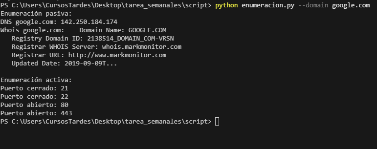
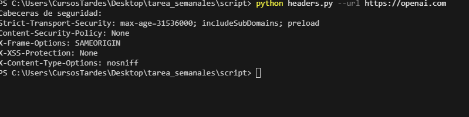
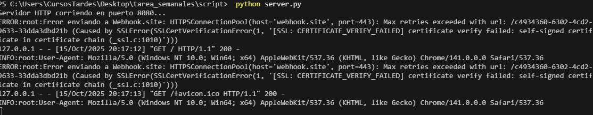

# OSINT:Finggerprint

## Indice
- [Estructura de archivos](#estructura-de-archivos)
- [Requisitos](#requisitos)
- [Uso](#uso)
  - [Enumeracion y analisis de cabeceras](#1-enumeracion-y-analisis-de-cabeceras)
  - [Captura de User-Agent](#2-captura-de-user-agent)
  - [Scripts individuales](#3-scripts-individuales)
- [Explicacion del codigo](#explicacion-del-codigo)
- [Seguridad](#seguridad)

Este proyecto contiene tres scripts principales en Python para realizar tareas de enumeracion pasiva y activa sobre dominios, analizar cabeceras de seguridad de sitios web y capturar el "user-agent" de las peticiones HTTP mediante un servidor propio.

## Estructura de archivos

- `enumeracion.py`: Realiza enumeracion pasiva (DNS, Whois) y activa (escaneo de puertos) sobre un dominio.
- `headers.py`: Recoge informacion de las cabeceras de seguridad de cualquier sitio web.
- `server.py`: Crea un servidor HTTP que captura el "user-agent" de las peticiones, lo guarda en `user_agents.txt` y lo envía automáticamente a una URL de Webhook.site para monitorización remota.
- `main.py`: Ejecuta los tres scripts de forma secuencial y permite pasar los parametros necesarios desde la terminal.
- `user_agents.txt`: Archivo donde se almacenan los user-agent capturados por el servidor(se crea al ejecutar el codigo la primera vez).

## Requisitos

- Python 3.7+
- Instalar dependencias:
  ```bash
  pip install requests python-whois urllib3
  ```

## Uso

### 1-enumeracion-y-analisis-de-cabeceras

Ejecuta el script principal pasando el dominio y la URL que quieras analizar:

```powershell
python main.py --domain google.com --url https://openai.com
```
  .
- Analisis de cabeceras de seguridad de la URL indicada.
- Lanzara el servidor HTTP en el puerto 8080.

### 2-captura-de-user-agent

Cuando el servidor esté corriendo, accede a:

http://localhost:8080

o desde otro dispositivo en la red:

http://<IP_DEL_SERVIDOR>:8080

Cada visita quedará registrada en el archivo `user_agents.txt` **y** el user-agent se enviará automáticamente a tu URL de Webhook.site para que puedas verlo online.

Ejemplo de URL de Webhook.site utilizada:

https://webhook.site/c4934360-6302-4cd2-9633-33dda3dbd21b

### 3-scripts-individuales

Tambien puedes ejecutar cada script por separado:

- **Enumeracion:**
  ```powershell
  python enumeracion.py --domain google.com
  ```
  

- **Cabeceras:**
  ```powershell
  python headers.py --url https://openai.com
  ```
    

- **Servidor:**
  ```powershell
  python server.py
  ```
    


## Explicacion-del-codigo

- **enumeracion.py:** Utiliza sockets para consultar DNS y escanear puertos, y la libreria `whois` para obtener informacion publica del dominio.
- **headers.py:** Realiza una peticion HTTP y muestra las cabeceras de seguridad mas relevantes.
- **server.py:** Implementa un servidor HTTP básico que guarda el user-agent de cada petición en un archivo local **y lo envía a Webhook.site para monitorización remota**.
- **main.py:** Permite automatizar todo el proceso y pasar los parametros necesarios desde la terminal.

## Seguridad
- El servidor HTTP solo almacena el user-agent y no expone informacion sensible.
- Los scripts no requieren privilegios elevados ni modifican archivos del sistema.

